# [시루와 방실이] 드림라이트
> 사용자 맞춤형 수면 관리 알람 어플 - 시루와 방실이 : 박성준, 박혜린
* * *
## 개요
드림라이트는 Asleep 인공지능을 기반으로 사용자 수면 패턴에 맞춘 기상알람 어플입니다.   
Asleep로 분석한 사용자의 실시간 수면 패턴에 맞추어 희망하는 기상시간 전에 개운하게 기상할 수 있도록 합니다.   
이를 통해 수면관성을 줄이고 기상 직후 수면 수행 능력 저하를 완화시켜줍니다.   
* * *
## 추진배경
 기존 앱들은 수면 패턴은 분석해주더라도 고정된 시간 알람만 제공했다는 한계가 있었습니다. 단순한 데이터 기록에 그치는 경우가 많았기에 사용자 친화적이지 않았습니다. 이런 상황에서, 드림라이트는 Asleep의 API를 활용해 이러한 문제를 해결하고자 했습니다. 기상 전 수면 단계에 따라 수면 관성의 정도가 다르게 나타납니다. 이와 관련하여 1~2단계에서 기상하는 것에 비해 서파수면에서 기상할 때 수면 관성이 더 크게 나타난다는 연구 결과가 있습니다. 이는 낮잠과 8시간 이상의 수면에서 모두 나타나며 수면 관성이 나타나면 수면 수행 능력의 일시적인 저하를 초래하는데, 이 시간이 서파수면 단계에서 기상할 시 더 크게 나타나게 됩니다. 이러한 연구 결과를 반영하여 수면의 질을 높이고 기상 시 수면 관성의 크기를 줄여 기상 직후 수면 수행 능력을 덜 저하시켜 삶의 질을 높이기 위해 이 아이디어를 제안하였습니다.
* * *
## 주요기능
- 사용자 맞춤형 기상시간 조정기능
- 사용자 평균 수면 주기 단위 수면 시간 설정 기능
- 최소 수면시간 보장기능
- 기본 알람기능
- 수면 시작시간 알람 기능
* * *
## UI
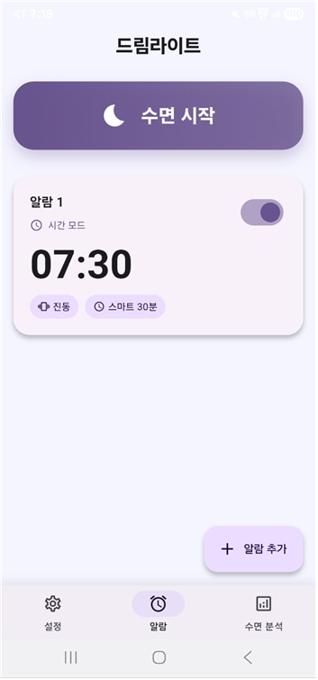

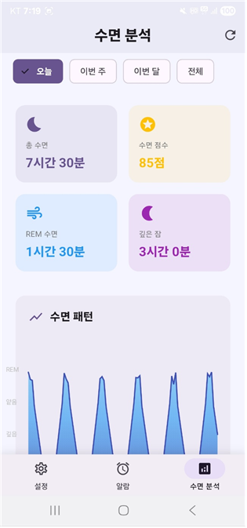
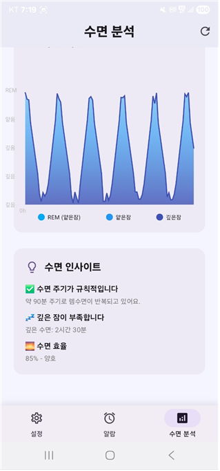

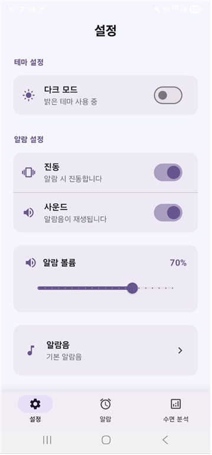

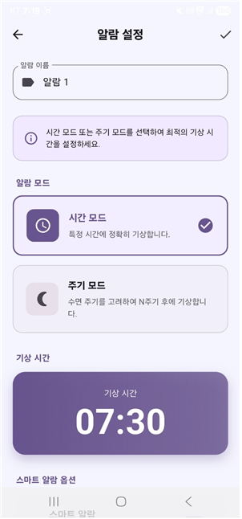
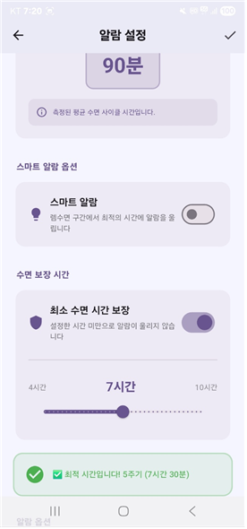
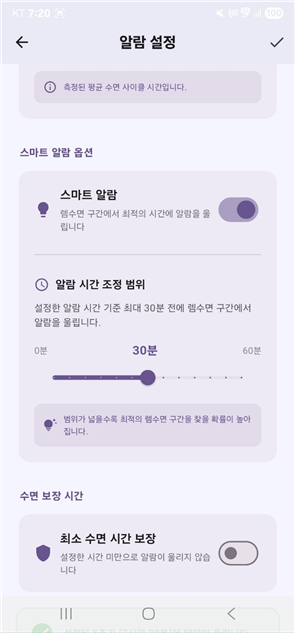
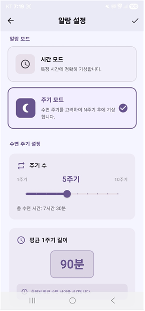

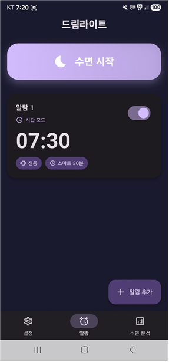
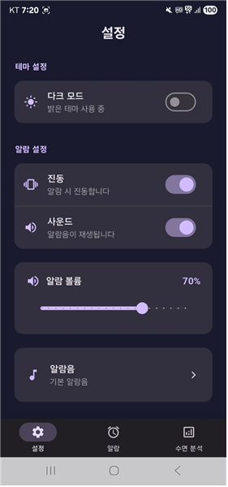

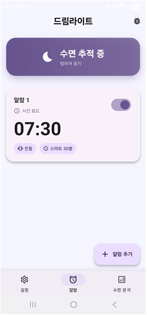
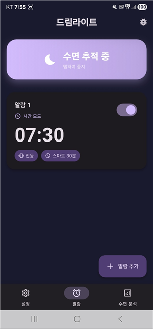

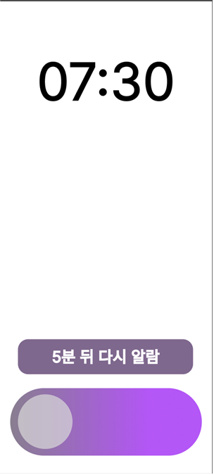
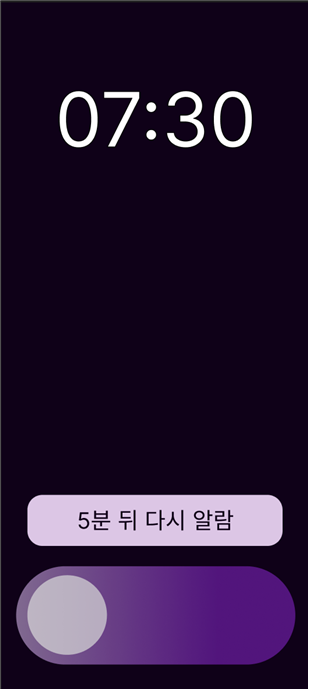

* * *
## 차별점
- 사용자 맞춤 알람 기능으로 기상 희망 시간 근처의 1~2단계의 수면 주기에서 개운한 기상 가능
- 사용자 개별 수면주기를 기상 시간 설정에 적용할 수 있게 하여 낮잠 등의 짧은 수면이나 일정 수면 주기 충족이 가능
- 최소 수면시간 보장 기능으로 사용자가 수면 단계에 돌입한 이후부터 수면 시간을 카운트 하여 원하거나 권장하는 수면시간 충족이 가능
- 기상을 원하는 시간과 충족하길 원하는 수면 시간을 입력하면 이를 계산하여 수면에 들어야 하는 시간을 알림
- 모든 기능을 사용자 설정에 따라 적용하여 기존의 알람 어플과 동일한 기능을 이용하거나 드림라이트의 기능을 이용하는 것 모두 유동적으로 가능
* * *
## 개발 환경(스택) 및 외부 연동
- 수면 질 분석 및 수면 주기 측정 : Asleep api
- 프론트엔드 : 안드로이드 스튜디오, flutter 프레임워크의 Dart
- DB : flutter 프레임워크
